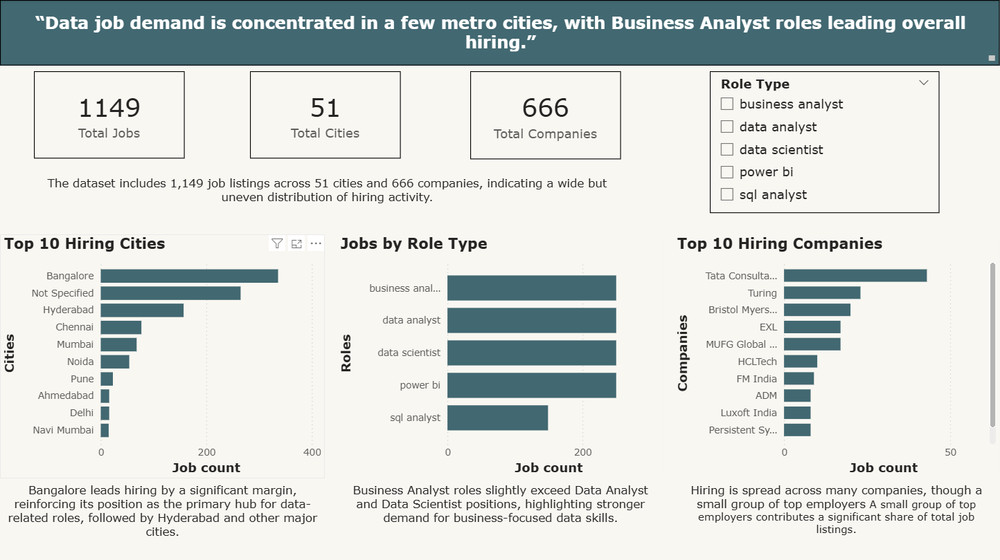
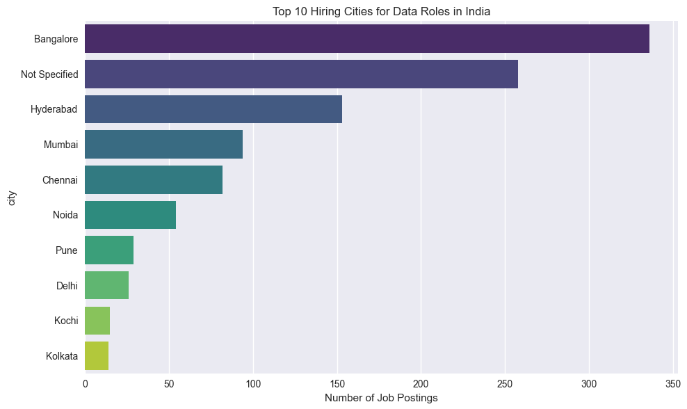
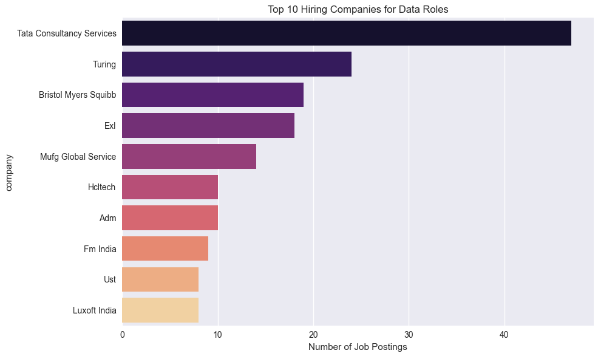

# 🚀 Job Market Pulse — Live Data Job Market Analysis

## 📊 Dashboard Preview



---

## 🚀 Key Insights

- Bangalore accounts for ~29% of job listings  
- Top 3 cities contribute ~66% of total jobs  
- Business Analyst roles lead demand  
- ~22% of listings lack location data  

---

## 📈 Visualizations




---

## ❓ Problem Statement

Understanding job market trends is difficult due to fragmented and inconsistent data sources.  
This project analyzes live job listings to identify hiring patterns across cities, roles, and companies.

---

## 📊 Dashboard (Power BI)

An interactive Power BI dashboard was built to explore:
- Hiring distribution across cities  
- Role demand trends  
- Top hiring companies  
- Market concentration  

---

# 🚀 Job Market Pulse — Live Data Job Market Analysis

An end-to-end data analytics project that collects live job listings from the Adzuna API and analyzes hiring trends across roles, cities, and companies in India.

---

## 🎯 Objective

To identify:

* Where data jobs are concentrated
* Which roles are most in demand
* How hiring is distributed across companies

using real-time job market data.

---

## ⚙️ Pipeline

Adzuna API → Data Ingestion → Data Cleaning → Analysis → Visualization → Insights

---

## 📂 Project Structure

```
job_market_pulse/
├── data/
│   ├── raw/              # Raw API data (gitignored)
│   └── processed/        # Cleaned datasets (gitignored)
├── notebooks/
│   └── analysis.ipynb    # Exploratory analysis & charts
├── src/
│   ├── analysis/         # Analytical scripts
│   ├── cleaning/         # Data cleaning pipeline
│   └── visualization/    # Plot generation scripts
├── data_ingestion.py     # API data collection
├── .gitignore
└── README.md
```

---

## 🛠️ Tools & Technologies

* Python (Pandas, Matplotlib, Seaborn, Requests)
* Adzuna API
* Jupyter Notebook
* Data Cleaning & Feature Engineering

---

## 📊 Key Insights

* **Bangalore accounts for ~29% of job listings**, making it the dominant hiring hub
* **Top 3 cities contribute ~66% of total jobs**, indicating strong geographic concentration
* **Business Analyst roles slightly exceed Data Analyst and Data Scientist roles**, highlighting demand for business-oriented skills
* **Hiring is distributed across many companies, but a few dominate listings**
* **~22% of job postings do not specify a city**, reflecting incomplete location data

---

## 📈 Dataset Summary

* Total Jobs Analyzed: **1,149**
* Cities Covered: **51**
* Companies: **666**

---

## ⚠️ Data Considerations

* Some listings lack location data and are grouped as **"Not Specified"**
* Data is fetched live via API and may vary over time

---

## ▶️ Setup & Execution

### 1. Install dependencies

```
pip install pandas matplotlib seaborn requests python-dotenv
```

### 2. Configure API credentials

Create a `.env` file:

```
ADZUNA_APP_ID=your_app_id
ADZUNA_APP_KEY=your_app_key
```

### 3. Run the pipeline

```
python data_ingestion.py
python src/cleaning/clean_data.py
python src/analysis/analysis_data.py
python src/visualization/visualisation.py
```

---

## 📌 Data Source

Adzuna API
https://developer.adzuna.com

---

## 🧠 Key Learnings

- Handling inconsistent real-world data (e.g., missing locations)  
- Building a structured data pipeline  
- Transforming raw API data into actionable insights  