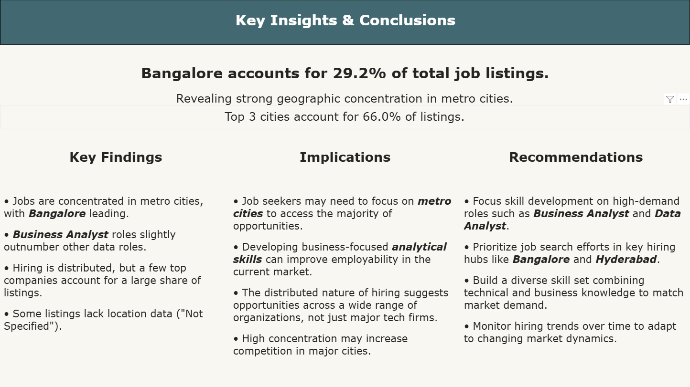

# 🚀 Job Market Pulse — Live Data Job Market Analysis

[](https://job-market-pulse-india.streamlit.app)
[](https://python.org)
[](https://railway.app)
[](https://streamlit.io)

An end-to-end data analytics project that collects live job listings from the Adzuna API, stores them in a cloud MySQL database, and visualizes hiring trends across roles, cities, and companies in India through a live interactive dashboard.

🔗 **Live Dashboard:** [job-market-pulse-india.streamlit.app](https://job-market-pulse-india.streamlit.app)

---

## 📌 Objective

To identify:
- Where data jobs are concentrated geographically
- Which roles are most in demand
- How hiring is distributed across companies

Using real-time job market data from the Adzuna API.

---

## ⚙️ Tech Stack

| Category        | Technologies                        |
| --------------- | ----------------------------------- |
| Programming     | Python                              |
| Database        | MySQL (Railway Cloud)               |
| Data Processing | Pandas                              |
| API             | Adzuna Jobs API                     |
| Visualization   | Power BI, Streamlit, Plotly         |
| Deployment      | Streamlit Cloud + Railway           |
| Environment     | Virtual Environment (.venv)         |

---

## 📂 Project Structure

```
job_market_pulse/
│
├── assets/
│   ├── dashboard.png
│   ├── insights.png
│   ├── top_cities.png
│   └── top_companies.png
│
├── data/
│   ├── raw/              # Raw API data (gitignored)
│   └── processed/        # Cleaned datasets (gitignored)
│
├── notebooks/
│   └── analysis.ipynb
│
├── src/
│   ├── analysis/
│   │   └── analysis_data.py
│   ├── cleaning/
│   │   └── clean_data.py
│   └── visualization/
│       └── visualisation.py
│
├── app.py                # Streamlit dashboard
├── data_ingestion.py     # API data collection
├── load_to_db.py         # MySQL loader
├── queries.sql           # SQL queries
├── Dashboard.pbix        # Power BI dashboard
├── .env.example
├── .gitignore
├── requirements.txt
└── README.md
```

---

## 🔄 Pipeline

```
Adzuna API
     ↓
Python (fetch + clean + transform)
     ↓
MySQL on Railway (cloud database)
     ↓
Power BI Dashboard (.pbix)
     +
Streamlit Dashboard (job-market-pulse-india.streamlit.app)
```

---

## 📊 Power BI Dashboard

Built an interactive Power BI dashboard exploring:
- Hiring distribution across cities
- Role demand trends
- Top hiring companies
- Market concentration

### Dashboard Preview

#### Page 1 — Market Overview


#### Page 2 — Key Insights


---

## 🌐 Streamlit Live Dashboard

Since Power BI requires a Pro license for public sharing, the dashboard was rebuilt using **Streamlit + Plotly** and deployed publicly on Streamlit Cloud — connected to the same cloud MySQL database on Railway.

🔗 **[job-market-pulse-india.streamlit.app](https://job-market-pulse-india.streamlit.app)**

### Features
- Market Overview — KPIs, top cities, role distribution, top companies
- Key Insights — headline stats, findings, implications, recommendations
- Interactive role filter dropdown
- Fully public — no login required

---

## 📈 Key Insights

- **Bangalore accounts for ~29% of job listings** — dominant hiring hub
- **Top 3 cities contribute ~66% of total jobs** — strong geographic concentration
- **Business Analyst roles slightly exceed Data Analyst** — demand for business-oriented skills
- **Hiring is spread across many companies** — few dominate listings
- **~22% of listings lack location data** — grouped as "Not Specified"

---

## 📋 Dataset Summary

| Metric | Value |
|---|---|
| Total Jobs | 1,149 |
| Cities | 51 |
| Companies | 666 |
| Role Types | 5 |

---

## ▶️ How to Run Locally

### 1. Clone the Repository
```bash
git clone https://github.com/rajanshaky/job-market-pulse.git
cd job-market-pulse
```

### 2. Create & Activate Virtual Environment
```bash
python -m venv .venv
.venv\Scripts\activate   # Windows
```

### 3. Install Dependencies
```bash
pip install -r requirements.txt
```

### 4. Configure Environment Variables
Create a `.env` file:
```env
ADZUNA_APP_ID=your_app_id
ADZUNA_APP_KEY=your_app_key
MYSQL_HOST=your_host
MYSQL_PORT=3306
MYSQL_USER=your_user
MYSQL_PASSWORD=your_password
MYSQL_DATABASE=your_database
```

### 5. Run the Pipeline
```bash
python data_ingestion.py
python src/cleaning/clean_data.py
python src/analysis/analysis_data.py
```

### 6. Launch the Dashboard
```bash
streamlit run app.py
```

---

## ⚠️ Data Considerations

- Some listings lack location data — grouped as "Not Specified"
- Each keyword fetched ~250 listings for balanced role representation
- Data reflects a snapshot of the market at time of collection

---

## 🧠 Skills Demonstrated

- REST API integration (Adzuna)
- ETL pipeline development
- Data cleaning & feature engineering
- Cloud MySQL management (Railway)
- Power BI dashboard development
- Streamlit + Plotly interactive dashboards
- Cloud deployment (Streamlit Cloud)
- End-to-end analytics workflow

---

## 📌 Data Source

[Adzuna Jobs API](https://developer.adzuna.com)

---

## 👨‍💻 Author

**Rajan Shaky**
Aspiring Data Analyst | Python • SQL • Power BI • Streamlit

[](https://github.com/rajanshaky)
[](https://linkedin.com/in/rajanshaky)

---

⭐ If you found this project useful, consider starring the repository!

